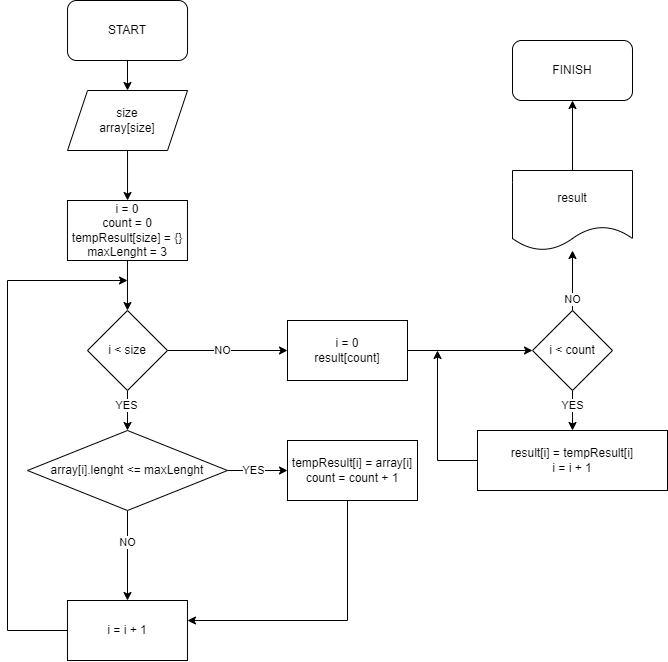

# Итоговая работа

## Задача
Написать Программу, которая из имеющегося массива строк формирует массив из строк, длина которых меньше либо равна 3. Первоначальный массив можно ввести с клавиатуры, либо задать на старте выполнения алгоритма. При решении не рекомендуется пользоваться коллекциями, лучше обойтись исключительно массивами. 

## Алгоритм
Перебираем строки исходного массива и заполняем промежуточный массив подходящими значениями, одновременно считая количество найденных значений
Далее уже инийциализируем итоговый массив под нужное количество элементов и заполняем из промежуточного

## Блок-схема

## Примечание
Для решения задачи используются написанные ранее готовые функции заполнения массива в цикле с клавиатуры и печати массива

